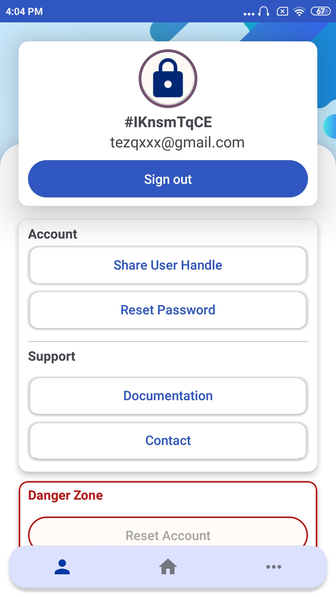
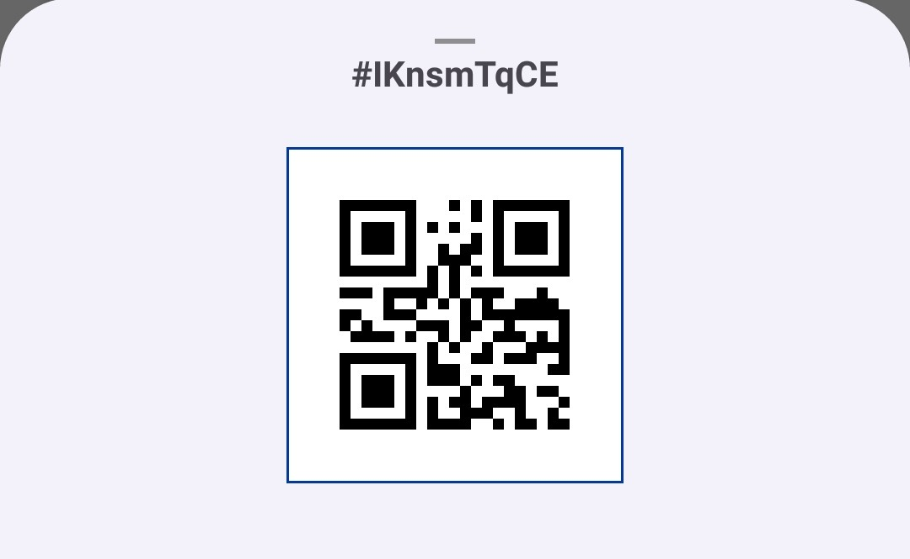
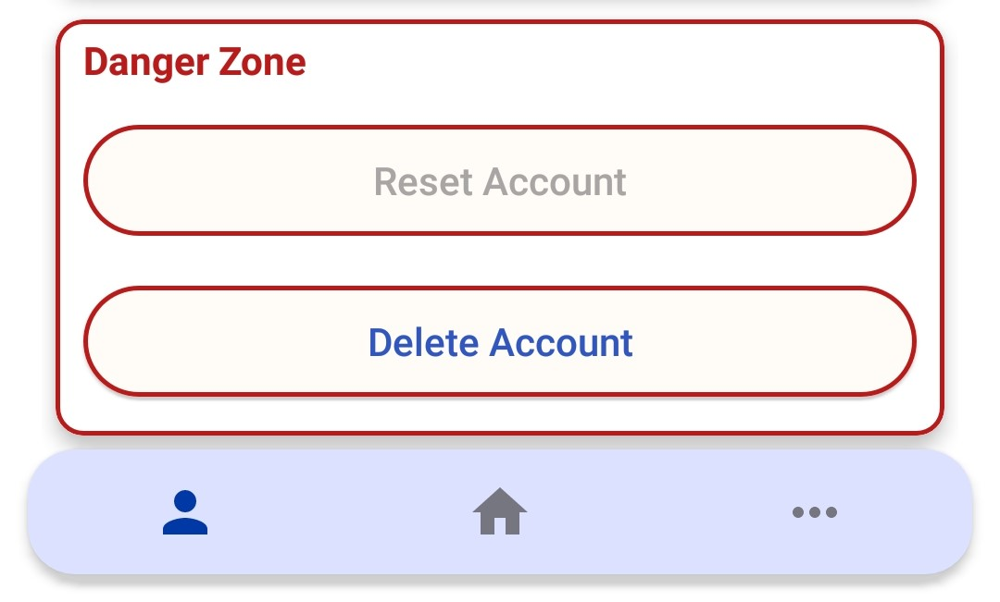
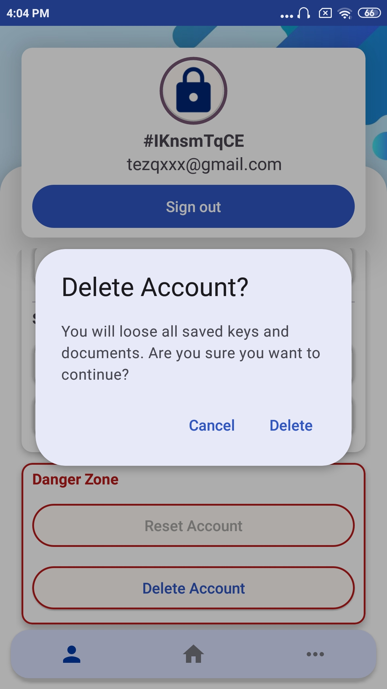

# User and UI Documentation

## Table of Contents

1. [Getting Started](#getting-started)

    1.1 [Installation](#installation)

    1.2 [Application startup](#application-startup)

    1.3 [User Registration](#user-registration)

2. [Authentication](#authentication)

    2.1 [Email-Password Login](#email-password-login)

    2.2 [Google Sign-In](#google-sign-in)
3. [Application](#application)
    
    3.1 [User profile](#user-profile)

    3.2 [Homepage](#homepage)

## Theme

---

     
    
    
    

#0039A6

#3858B7

#aa86a4

#919094

## Getting Started

### Installation

### Application startup
After opening application, internet connection will be checked. If the internet connection is unavailable
user cannot enter the application and will be asked to check connection again.

    
    

### User Registration

1. Launch the app.
2. On the welcome screen, select "Sign up"
3. Enter your email and create a secure password.
4. Follow the prompts to complete the registration.

Any of following error messages can be displayed:
- invalid email
- Min. 6 and max. 12 characters
- Invalid password
- Passwords do not match

**Google Sign in**
1. Launch the app.
2. On the welcome screen, select "Sign up"
3. Click on Google logo
4. Follow the prompts to complete the registration.

Upon Failed registration all input fields will be emptied. Upper left corner contains back arrow to return to
main page.

    
    

## Authentication

   

### Email-Password Login

1. Open the app.
2. Enter your registered email and password.
3. Tap "Sign in"

### Google Sign-In

1. Open the app.
2. Select Google image on the screen.
3. Choose your Google account to authenticate.

### Password reset

1. Open the app.
2. Select "Forgot password".
3. Fill in your email.
4. Tap "Send"
5. Follow instructions from received email to finish password reset

   

   

### Log in / Log out splash screen

---

## Application

### User Profile
Profile settings management, key management excluded. The app provides simple and straightforward card design for better
UX. Danger zone provides "dangerous" user actions such as deleting and resetting account -> this part is red highlighted.

Main card shows lock icon (possible change to user profile picture), user handle-unique user ID, email of current
user and visible Sign Out button. Main card has scrollview to be more comfortable for user on different devices.

    

**Account** 
- Share User Handle 
   
   - Creates QR code of user ID and shows it to user via Bottom sheet dialog
   - Navigation - swipe down or touch screen to close dialog

    

- Reset Password

   - Send reset email to currently signed user (not possible for google sign in accounts)
   - Shows to user message based on the outcome - "email sent", "failed to send email"

**Support**
- Documentation

   - Redirects user to specified website - this public documentation
- Contacts

   - Redirects user to contacts page - currently contacts file in this repository
  
**Danger zone**

    

- Reset Account (Beta) currently disabled

   - Resets account - deletes all documents and keys of currently signed in user
   - Warning dialog is displayed to ask user for confirmation of this action

- Delete Account
   
   - Deletes all user information from database and account
   - Warning dialog is displayed to ask user for confirmation of this action

    

### Homepage 

After sign in homepage appears for user to choose what action to continue with.

### Key management
 
### Documents Management

**To be continued...**
