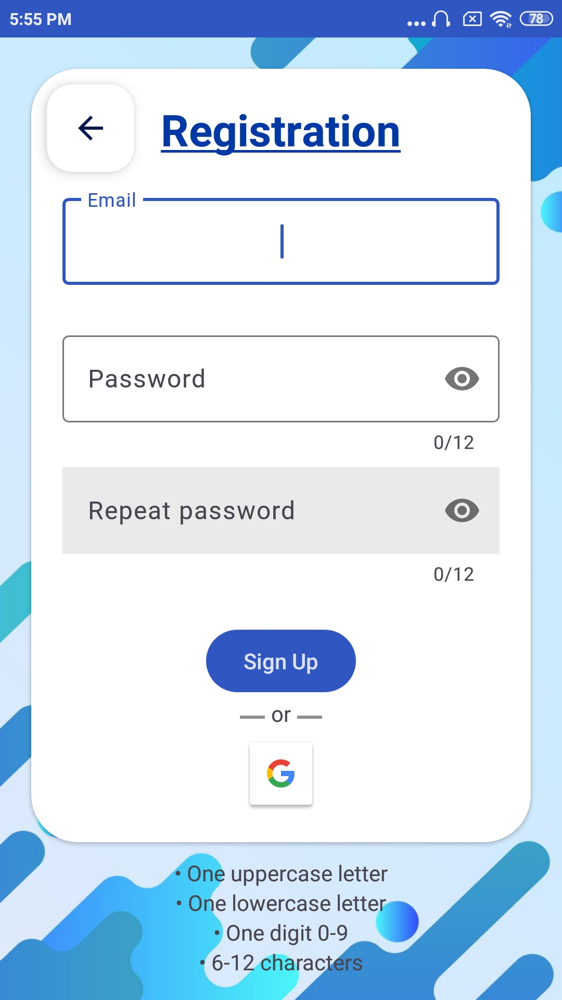

# User and UI Documentation

## Table of Contents

1. [Getting Started](#getting-started)

    1.1 [Installation](#installation)

    1.2 [Application startup](#application-startup)

    1.3 [User Registration](#user-registration)

2. [Authentication](#authentication)

    2.1 [Email-Password Login](#email-password-login)

    2.2 [Google Sign-In](#google-sign-in)

## Theme

---

     
    
    
    

#0039A6

#3858B7

#aa86a4

#919094

## Getting Started

### Installation

### Application startup
After opening application, internet connection will be checked. If the internet connection is unavailable
user cannot enter the application and will be asked to check connection again.

    
    

### User Registration

1. Launch the app.
2. On the welcome screen, select "Sign up"
3. Enter your email and create a secure password.
4. Follow the prompts to complete the registration.

Any of following error messages can be displayed:
- invalid email
- Min. 6 and max. 12 characters
- Invalid password
- Passwords do not match

**Google Sign in**
1. Launch the app.
2. On the welcome screen, select "Sign up"
3. Click on Google logo
4. Follow the prompts to complete the registration.

Upon Failed registration all input fields will be emptied. Upper left corner contains back arrow to return to
main page.

    
    

## Authentication

   

### Email-Password Login

1. Open the app.
2. Enter your registered email and password.
3. Tap "Sign in"

### Google Sign-In

1. Open the app.
2. Select Google image on the screen.
3. Choose your Google account to authenticate.

### Password reset

1. Open the app.
2. Select "Forgot password".
3. Fill in your email.
4. Tap "Send"
5. Follow instructions from received email to finish password reset

   

   

## Application

**To be continued...**
